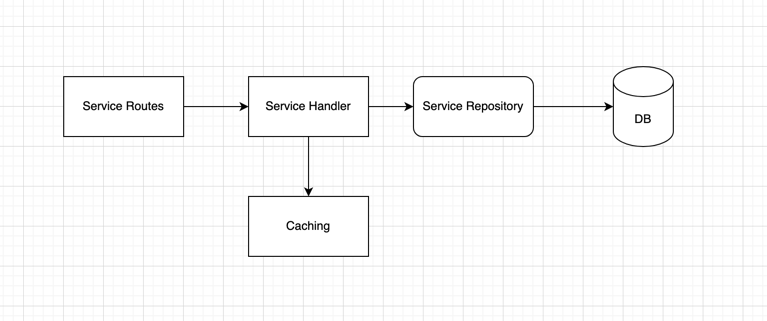
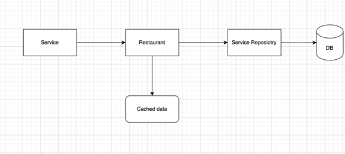
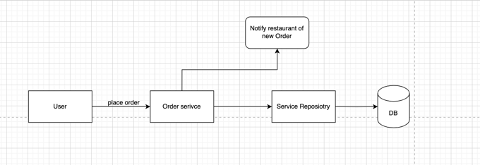
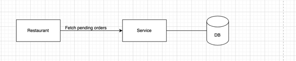
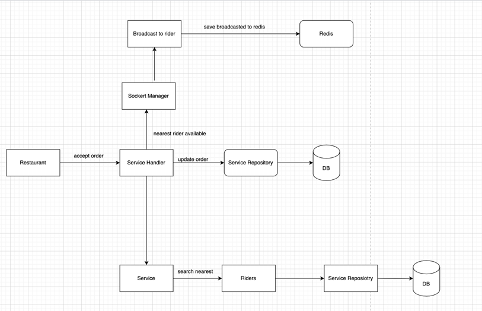
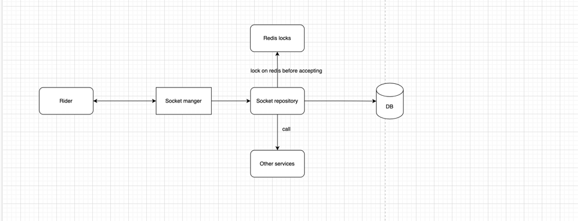
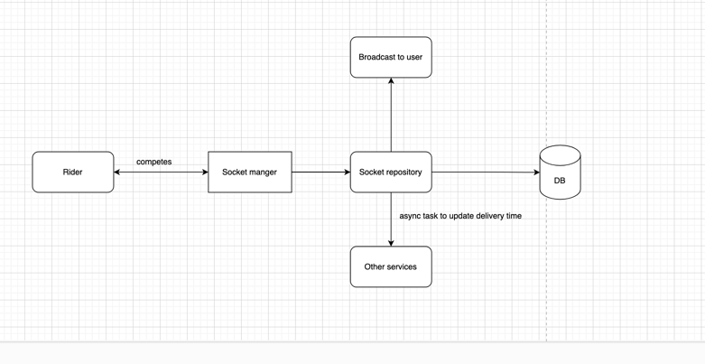
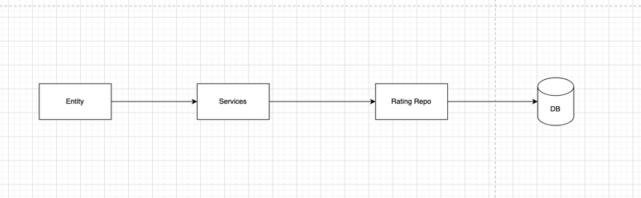

### Food Eats

This application is a small demonstration of a food delivery app. There are many assumptions that have been
taken for this application.

### Installation

This is a pretty simple application to run; you just need go1.21, mongodb and redis. I have included a build file in
this as well.
TODO: add docker compose file for running it seamlessly anywhere.

```shell
go run cmd/web/main.go
```

### Requirements

### Logging

I have created custom json logger, so I can have request id, and other this.
More over we should also hide sensitive information by not logging it. To do this, we can have a function on it.

```go
// hiding sensitive information while logging
func (c User) LogValue() slog.Value {
var attributes []slog.Attr
attributes = append(attributes, slog.Attr{Key: "user_id", Value: slog.AnyValue(c.Id)})
return slog.GroupValue(attributes...)
}

```

#### Mandatory

1. Create User, Restaurant and Rider.
2. Search Restaurant based on location, name and food type.
3. Assign delivery partners
4. Track order
5. Give rating
6. Show delivery time

#### Bonus

1. Rating system
2. Delivery time
3. Coupouns

## Assumptions

### Base Assumptions

1. Authentication is assumed to handled by the services
    1. Like we can have fcm login and can create access tokens to each of the entities
2. Authorisation is assumed to be handled like admin roles and all.
3. I have put some validations on creating records like phone number should be in format e164 ie (+91111111111) and only
   india phone numbers are allowed
4. Order can not be cancelled
5. Valid longitude and latitude in string body
6. Running via flag for now, can have different config files, and can call production, staging or development using the
   execution environment.
7. Long pooling from restaruants to get new pending orders, this can be done via a notification in future.
8. App will poll location for rider every some time. This is done so that the indexed collection doesn't have load due
   to continous update when delivering.
9. For some part i have hardcoded the distance like searching nearest 10km rider when assigning order.

_Note one major assumption is that this is a monolith but in real world application we should make it microservices. We
can have
different services like_
_1. Restaurant Service. This handles all restaurant-related task like CRUD, accept order, view orders._
_2. User Service. This handles all user-related task like CRUD, create order, view orders._
_3. Rider Service. This handles all rider-related task like CRUD, view order, accept orders, give ratings._
_3. Track Service. This handles management of order tracking with client. It will have web sockets_

#### Database

#### Assumption

I choose MongoDb as i’m more comfortable in it. Though i have tried to make the model layer as modular as possible so
swapping with any other database can be done easily and quickly without any integration issues.

Indexes which are intuitive like on created date are not mentioned

#### User Schema

Assumption: one record for email and phone number only so applied unique index

```json
{
  "id": "6605bbde13730d5a6839c81a",
  "name": "John Doe",
  "email_id": "john.doe@example.com",
  "phone_number": "+913456789000",
  "created_at": "2024-03-29T00:20:06.532734+05:30",
  "updated_at": "2024-03-29T00:20:06.532734+05:30",
  "address": "123 Main Street",
  "location": {
    "type": "Point",
    "coordinates": [
      28.6208,
      77.296
    ]
  },
  "averageRating": 0,
  "status": "ACTIVE"
}
```

### Restaurant

Assumption: one record for email and phone number only so applied unique index
Index: on location 2dsphere index

```json
{
  "id": "6605c143c9d9510b77c86a88",
  "name": "Burger Palace",
  "email_id": "burgerpalace@example.com",
  "phone_number": "+919876543210",
  "website": "burgerpalace.com",
  "created_At": "2024-03-29T00:43:07.013234+05:30",
  "UpdatedAt": "2024-03-29T00:43:07.013234+05:30",
  "address": "Connaught Place, Delhi",
  "location": {
    "type": "Point",
    "coordinates": [
      77.2195,
      28.6315
    ]
  },
  "average_rating": 0,
  "status": "ACTIVE",
  "cuisines": "Fast Food",
  "meal_type": "Fast Food",
  "menu": {
    "items": [
      {
        "name": "Classic Cheeseburger",
        "description": "Juicy beef patty topped with melted cheese, lettuce, and tomato",
        "price": 199.99,
        "item_type": ""
      },
      {
        "name": "Crispy Chicken Sandwich",
        "description": "Fried chicken breast served on a bun with lettuce and mayo",
        "price": 179.99,
        "item_type": ""
      },
      {
        "name": "Spicy Chicken Wings",
        "description": "Crispy chicken wings tossed in spicy buffalo sauce",
        "price": 149.99,
        "item_type": ""
      },
      {
        "name": "Fries",
        "description": "Crispy golden French fries",
        "price": 79.99,
        "item_type": ""
      }
    ]
  }
}
```

### Rider

Assumption: one record for email and phone number only so applied unique index
Index: on location 2dsphere index

```json
{
  "id": "6605c348c9d9510b77c86a89",
  "name": "Rider 1",
  "email_id": "rider1@example.com",
  "phone_number": "+910000000001",
  "created_at": "2024-03-29T00:51:44.439276+05:30",
  "updated_at": "2024-03-29T00:51:44.439276+05:30",
  "address": "Connaught Place, Delhi",
  "location": {
    "type": "Point",
    "coordinates": [
      77.295,
      28.6208
    ]
  },
  "averageRating": 0,
  "status": "ACTIVE"
}
```

### Order

Creating a order
index is on restaurantId, userId and deliveryPersonId.
delivery time denotes seconds in which we delivered.

```json
{
  "_id": ObjectId(
  "660616dc330e7f30aca19526"
  ),
  "userId": ObjectId(
  "6605bbde13730d5a6839c81a"
  ),
  "restaurantId": ObjectId(
  "6605c143c9d9510b77c86a88"
  ),
  "riderId": ObjectId(
  "6605c348c9d9510b77c86a89"
  ),
  "deliveryPhoneNumber": "",
  "deliveryLatitude": 77.296,
  "deliveryLongitude": 28.6208,
  "address": "123 Main Street",
  "pickupPhoneNumber": "",
  "pickupLatitude": 77.296,
  "pickupLongitude": 28.6208,
  "pickupAddress": "Connaught Place, Delhi",
  "items": [
    {
      "name": "Classic Cheeseburger",
      "description": "Juicy beef patty topped with melted cheese, lettuce, and tomato",
      "price": 199.99000549316406,
      "itemType": ""
    },
    {
      "name": "Crispy Chicken Sandwich",
      "description": "Fried chicken breast served on a bun with lettuce and mayo",
      "price": 179.99000549316406,
      "itemType": ""
    },
    {
      "name": "Spicy Chicken Wings",
      "description": "Crispy chicken wings tossed in spicy buffalo sauce",
      "price": 149.99000549316406,
      "itemType": ""
    }
  ],
  "finalPrice": 529.9700317382812,
  "latitude": 77.296,
  "longitude": 28.6208,
  "deliveryTime": 1134.962409,
  "createdAt": ISODate(
  "2024-03-29T01:18:20.302+0000"
  ),
  "updatedAt": ISODate(
  "2024-03-29T01:37:38.264+0000"
  ),
  "status": "DELIVERED",
  "acceptedAt": ISODate(
  "2024-03-29T01:18:43.302+0000"
  ),
  "deliveryStarted": ISODate(
  "2024-03-29T01:31:55.250+0000"
  ),
  "deliveredAt": ISODate(
  "2024-03-29T01:37:38.264+0000"
  )
}

```

### Rating

Assumptions i have created a compound unique index on rating_giver+rating_reciever+order_id. So only one rating is
allowed

```json
{
  "id": "66062687785bd8d9b6f2718f",
  "rating_giver": "6605bbde13730d5a6839c81a",
  "rating_receiver": "6605c143c9d9510b77c86a88",
  "order_id": "66061f7bebe238d0ecaf0f63",
  "rating_giver_type": "user",
  "rating_receiver_type": "restaurant",
  "rating": 4,
  "created_at": "2024-03-29T07:55:11.617291+05:30",
  "updated_at": "2024-03-29T07:55:11.617292+05:30",
  "comment": "Great service, delicious food!"
}
```

### State after rating and delivery time update

```json
{
  "_id": ObjectId(
  "6605c143c9d9510b77c86a88"
  ),
  "name": "Burger Palace",
  "emailId": "burgerpalace@example.com",
  "phoneNumber": "+919876543210",
  "website": "burgerpalace.com",
  "createdAt": ISODate(
  "2024-03-28T19:13:07.013+0000"
  ),
  "updated_at": ISODate(
  "2024-03-28T19:13:07.013+0000"
  ),
  "address": "Connaught Place, Delhi",
  "location": {
    "type": "Point",
    "coordinates": [
      77.2195,
      28.6315
    ]
  },
  "averageRating": 4.0,
  "averageTime": 1324.2,
  "status": "ACTIVE",
  "cuisines": "Fast Food",
  "mealType": "Fast Food",
  "menu": {
    "items": [
      {
        "name": "Classic Cheeseburger",
        "description": "Juicy beef patty topped with melted cheese, lettuce, and tomato",
        "price": 199.99000549316406,
        "itemType": ""
      },
      {
        "name": "Crispy Chicken Sandwich",
        "description": "Fried chicken breast served on a bun with lettuce and mayo",
        "price": 179.99000549316406,
        "itemType": ""
      },
      {
        "name": "Spicy Chicken Wings",
        "description": "Crispy chicken wings tossed in spicy buffalo sauce",
        "price": 149.99000549316406,
        "itemType": ""
      },
      {
        "name": "Fries",
        "description": "Crispy golden French fries",
        "price": 79.98999786376953,
        "itemType": ""
      }
    ]
  }
}

```

Will get this error if same entities tries to give another rating

```curl
"write exception: write errors: [E11000 duplicate key error collection: food-eats.Rating index: ratingGiver_1_ratingReceiver_1 dup key: { ratingGiver: ObjectId('6605bbde13730d5a6839c81a'), ratingReceiver: ObjectId('6605c143c9d9510b77c86a88') }]"
```

## Low Level Design

1. CRUD operations.
   This flow will be used have crud functionality on services routes and handler.
   a. We have a data repository and that is connected to a database
   b. We have a service layer that is the handler. It handles all the business logic and it uses caching for
   optimisation.
   c. We have routes, when a specific route is called, it then calls hanler or service layer to do operation.
   

2. Search Restaurant
   Searching a restaurant is a user dependent field. We have used mongodb geo-Spatial index to query and find the
   restaurants.
   Searching using geo spatial we need to have points and radius. I have used aggregation for this part, the reason is i
   wanted some computations to be done.
   When a user search restaurant, we apply filters. We find out the distance of the user from the restaurant, and using
   this we provide a average delivery time
   

3. Order management
   User places a order, the service create a new order in the DB. _I'm not sending a push notification to restaurants,
   i'm assuming a long pooling_
   

Restaurant fetches from database all the pending orders.


Restaurant accepting orders involves first searching riders. Searching in rider based on the location of restaurant, a
maximum 10km radius is selected,
and top 10 based on rating are fetched. The fetched riders will be saved in redis, this is done to broadcast order
accepted to all other riders
in case if one of them picks.

```go
    // sorting by reverse rating
sortQuery := bson.M{"distance": 1, "rating": -1}
```



After feching all riders, we broadcast this message to all riders using websockets.
To maintain consistency i have used redis INCR. As redis provides atomicity and INCR will increment the counter, so if
counter != 1, that means
order was picked by other rider.

When order is picked, the socket will send the location and we will broadcast it to the user.


When order is completed.

We mark it as complete, and we call update delivery time to get a new average delivery time. This can be done using
kafka or any other message queue, for this i'm using goroutines

4. Rating System
   For rating we have a constraing on giverId, recieverId and order, so only one document to this combination is
   present.
   We have a giver type and a reciever type, based on that we do call the corresponding service
   and add to their average rating.
   

### Handle of scale

Their are many optimsations which we can do,

1. We can use message queses and pub/sub to have more resilient and fast approach as it can be deployed in multiple
   server. One case could be when order is completed and we need some computation, we can push into queue and async it
   will be processed.
2. We can use redis for caching location, redis also provides geo spatials index, so are a user, we can store the
   restarunt in a cache. So any other user from similar proximity we can use the cache.
3. We can improve the socket management by using socket server manager and have different servers. The server manager
   will provide which socket is connected to which server.
4. We can shard our mongo data, so it can be fetched in a more optimised way, like we can have a shard on zone, delhi
   person doesn't need the records for banglore restaruants.
   Sharding comes at a cost so we must be careful in doing that.
5. We can move the stale data like orders from last 1 year can be moved to our secondary disk, and we keep new data for
   quering.
6. We can use external services for fetching the approximate time.

### References

1. Lets Go by alex edwards
2. https://github.com/mo-pankaj/tructured-logging-echo
3. Google